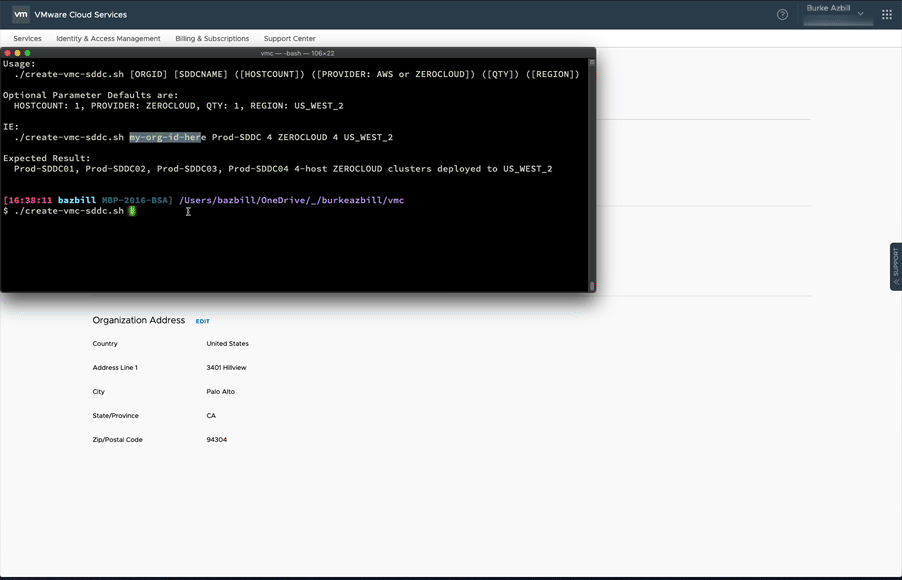

# vmc-aws-scripts

VMware Cloud on AWS Scripts

## Overview

Be sure to review the article regarding this repo here: https://www.livefire.solutions/cloud-services/bulk-creation-of-vmc-on-aws-sddcs/

**Purpose:** The scripts contained in this repository interact with the VMware Cloud on AWS REST API. As such, they read a text file named **.vmc-aws-auth.txt** in your home directory. The files should be well-documented with comments so be sure to review them before running.

 *(**NOTE:** If you run one of the scripts and the file is not found, you will be prompted for the necessary information and the file will be created for you!)*

 For reference, the contents of that config file are as follows:


```bash
# Organization Name: Your Organization Name here
export ORGID="your-organization-id-here"
export REFRESH_TOKEN="your-refresh-token-here"
```

### How can they help you

The scripts can be used as-is or as building-blocks/starting points for your own SDDC automation, assuming you have a VMware Cloud on AWS account!

## org

Organization level scripts:

- /org/get-vmc-org-json.sh : Retrieves details for the specified organization and outputs them into ORG_INFO.json

## sddc

- /sddc/get-vmc-sddcs-json.sh : Gets details on all SDDCs created in the specified organization and outputs them into SDDCS_INFO.json
- /sddc/show-sddcs-info.sh : this script will process and display a summary from the SDDCS_INFO.json file generated by the /sddc/get-vmc-sddcs-json.sh script
- /sddc/get-vmc-sddc-info.sh : Displays a summary for the given SDDC, and outputs the info to SDDC_INFO.json
- /sddc/create-vmc-sddc-by-name.sh : Creates 1 or more SDDCs using the specified parameters or safe defaults. Note that if a provider is not specified or is not typed correctly, then ZEROCLOUD will be used by default so that no charges result from an accidentally deployed SDDC.
- /sddc/create-vmc-sddc-by-file.sh : Creates 1 or more SDDCs using the specified parameters or safe defaults. Note that if a provider is not specified or is not typed correctly, then ZEROCLOUD will be used by default so that no charges result from an accidentally deployed SDDC. In this case, a filename is provided that should have SDDC names on each line (1 per line) of the file
- /sddc/cleanup-vmc-sddcs-by-file.sh : Cleans up SDDCs specified in the cleanup file that was genterated by the create-vmc-sddc-by-file.sh script
- /sddc/cleanup-vmc-sddcs-by-name.sh : Cleans up SDDCs that begin with the name/prefix specified

## SAMPLE


