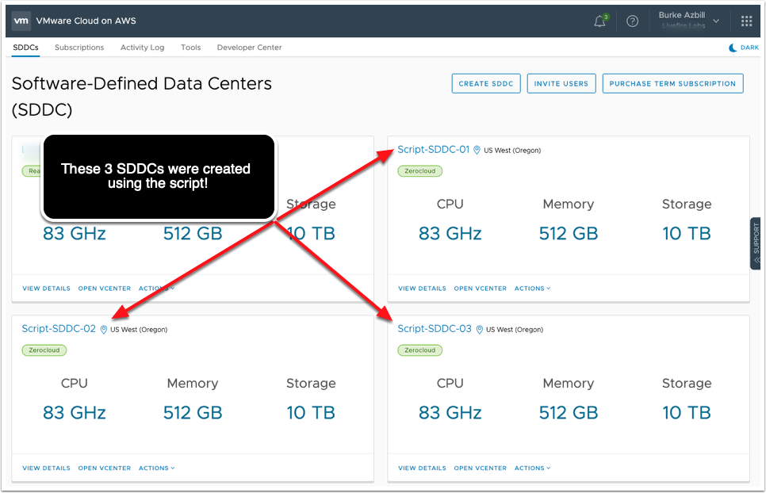

# Sample Output

## show-sddcs-info.sh

```plain
=================================================
SDDCName: DEMO-SDDC01
SDDCID: ********-****-****-****-**********
Version: 1.7 Patch 01v2
CreateDate: 2019-06-23T07:20:53.000012Z
User_Name: myuser@mydomain.local
ExpirationDate: 2019-07-23T07:20:53.000012Z
DeploymentType: SINGLE_AZ
Region: US_WEST_2
AvaiabilityZone: us-west-2b
InstanceType: i3.metal
VpcCIDR: 10.2.0.0/16
PoPIP: 10.2.144.4
NSXT: true
VPC_VGW: vgw-***************
=================================================
SDDCName: DEMO-SDDC02
SDDCID: ********-****-****-****-**********
Version: 1.7 Patch 01v2
CreateDate: 2019-06-19T11:18:35.000393Z
User_Name: myuser@mydomain.local
ExpirationDate: 2019-07-19T11:18:35.000393Z
DeploymentType: SINGLE_AZ
Region: US_WEST_2
AvaiabilityZone: us-west-2c
InstanceType: i3.metal
VpcCIDR: 10.2.0.0/16
PoPIP: 10.2.144.4
NSXT: true
VPC_VGW: vgw-***************
```

## create-vmc-sddc.sh

```plain
# Command Issued:
./create-vmc-sddc.sh my-org-id Script-SDDC- 1 ZEROCLOUD 3 US_WEST_2
# Output:
Creating SDDC: Script-SDDC-01
Creating SDDC: Script-SDDC-02
Creating SDDC: Script-SDDC-03

Elapsed: 0hrs 0min 19sec
```


